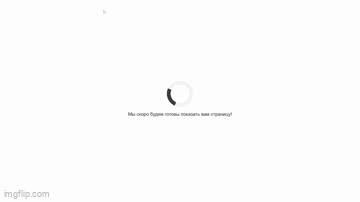

# Candy-Shop
### A project based on REST-API and JavaScript.

## Used technologies:
- HTML and CSS
- JS (to serve frontend templates by sending requests to the Django server)
- Django (ONLY to establish REST-API endpoints to manipulate displayed data within templates and store data in the DB. No views used.)

## Web-site pages:
- Main: Displays candies added by users or by the admin.
- Add-Candy: Add a new candy and its parameters such as price, weight, owner, producer, and user rating.
- One-Candy-Page: A page for each candy, providing more details.

Ngrok was used to "publish" the website on the Internet and allow it to run on a local machine.

## Rest-Api endpoints:
- users/ 
- users/<int:pk>/
- candies/
- candies/<int:pk>/
- customusers/
- customusers/<int:pk>/
- producers/
- producers/<int:pk>/
